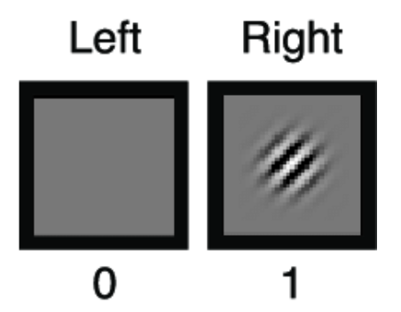
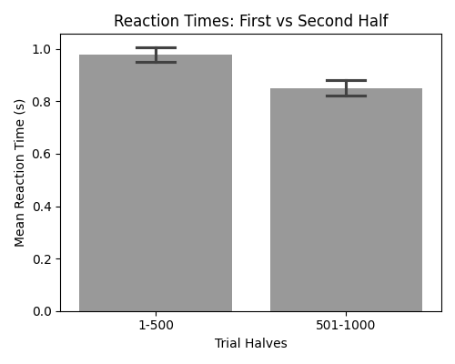
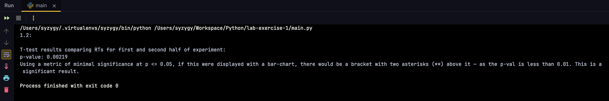
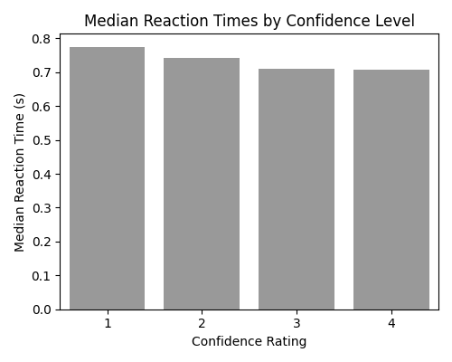
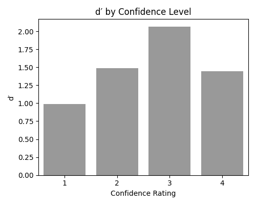
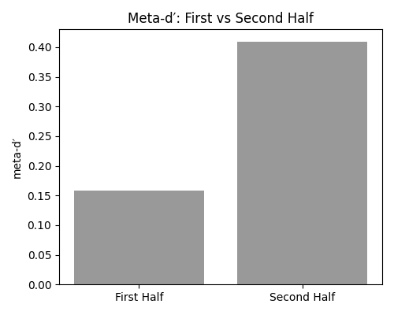
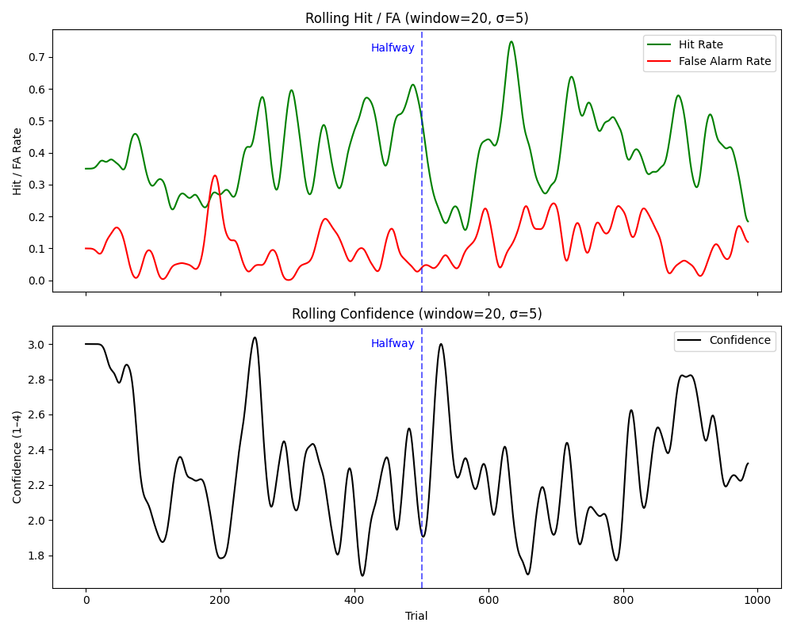

# cnclab-onboarding-exercises

> *Last updated: October 18, 2025*

Hello there. Whether here by accident or intentionally, all of your life paths have converged in
such a way that you just so happen to be at this "location" in this moment. Enjoy your finite stay.

### uh... okay. what is this?

Code exercise(s) I worked on for the [CNC (Cognitive and Neural Computation) Lab](https://www.cnclab.io/) at
[UC Irvine](https://www.cogsci.uci.edu/research/index.php) in 2025!

(The PI in charge of the lab, [Megan Peters](https://www.linkedin.com/in/megan-peters-58a86133/),
is moving the following school year to
[University College London](https://www.ucl.ac.uk/brain-sciences/pals/research/experimental-psychology),
to the [MetaLab](https://metacoglab.org/) run by PI [Stephen Fleming](https://www.linkedin.com/in/steve-fleming-76969b13/).)
 
> *P.S. — If that CNC Lab link doesn't work, try [this archived one](https://archive.ph/LAAOo).*

Wow, I should read [Fleming's articles on *Aeon*](https://aeon.co/users/stephen-m-fleming)...! I didn't even know
they were there. I already regularly read *Psyche* and *Aeon*, so I'll add that to my (rapidly growing) list.
Maybe when I finish [*Gödel, Escher, Bach*](https://en.wikipedia.org/wiki/G%C3%B6del%2C_Escher%2C_Bach), anyway.

Ahem! Anyway, what was I saying?

### ...could you be more specific?

Glad you asked! I was basically given (what I presume to be) one participant's data from an
experiment they ran way back in 2009 (gathering by the .mat file's original timestamp, and being the
only thing I could read in that unholy archive format through the PyCharm previewer, with encoding entirely
messed up).

### you talk a lot.

I'll agree with you on that one and stick a confidence level of 4, good sir/ma'am. God fears what my meta-d' values are. 
At least my d' is decent[citation needed]...

Alright.
### The specific steps/instructions are below:

Subjects were given a simple psychophysics experiment.

They:

- saw two circles of visual noise on the left and right sides of the screen,
where only one of the patches contained a sinusoidal (smooth periodic oscillation) visual grating
- had to say (make an educated guess on.) which stimulus had the grating (left or right)
- had to rate how confident they were that their answer was correct, on a scale of 1 to 4.

e.g. —

 

Except that flashes way faster in the experiment (on the order of milliseconds :')), and it probably wouldn't be that
obvious, by design, because experimenters need false hits/alarms in order to properly run calculations on this kind of thing.
Mandatory feeling bad, confused, and like an idiot during the experiment. Makes for some delicious varying d' and meta-d'
values. (Sorry not sorry. If anything, IRBs will make sure it won't get to Milgram levels of bad. Trust me.)

## 1.1
1. Plot the mean reaction time for the first half of the experiment.
2. Do the same for second half of the experiment.
3. Put error bars (standard error of mean) on the two bars representing the reaction times.
4. Put labels and everything to make it look nice. Make the graph black and white only, and print it out.

 

## 1.2
1. Run a t-test to see if the RTs for the first and second half of the experiment differed significantly.

 

Since this one didn't ask for a graph, the output was in the console.

### Alt-text:

1.2:

T-test results comparing RTs for first and second half of experiment;

p-value: 0.00219

Using a metric of minimal significance at p <= 0.05, if this were displayed with a bar-chart, there would be a bracket with two asterisks (**) above it — as the p-val is less than 0.01. This is a significant result.

## 1.3
1. Plot the median reaction times for lvl 1 confidence level.
2. Do the same for lvl 2.
3. Do the same for lvl 3.
4. Do the same for lvl 4.

(You don’t need error bars for this one or the following ones.)

 

## 1.4
1. Calculate and plot d’ for lvl 1 confidence level.
2. Do the same for lvl 2.
3. Do the same for lvl 3.
4. Do the same for lvl 4.

 

(Instructions: Something to think about: now that you have calculated the 4 d’ values for each confidence level,
do you think this is theoretically a correct thing to do? Answer: according to SDT, not really. Think about why not.)

I've annotated somewhere:

answer: introduces response bias. d’ only works if you assume one criterion across all trials, and binning them
unnecessarily restricts data. setting new criteria would mess up the d primes, and now they’re not really reflective of anything.

## 1.5
Ah, the dreaded meta-d'.

1. Calculate and plot meta-d’ for the first half of the experiment.
2. Do the same for second half of the experiment.

 

### and this was not part of the task, but:
Just for fun, and with some help from ChatGPT ("credit" where credit is due), out of curiosity I also decided to plot
a running means graph comparing confidence with the hit and false alarm rates. Got this interesting graphic:

 

One thing I want to make clear right now. LLMs are simultaneously smart and stupid. They can write surprisingly well-written
code at times, but other times they entirely miss the context, or, as some astute scholars (Hicks *et al.* 2024) have noted,
["ChatGPT is Bullshit."](https://link.springer.com/article/10.1007/s10676-024-09775-5)
(Their words, not mine; and in the academic, Frankfurtian sense, before you come at me.)

That is, LLMs like ChatGPT hold zero regard for the level of veracity in their semantic vomit (regardless of programming
or natural languages). They have shockingly poor metacognitive skills (if you could even dignify those with a name), but
this is beyond the scope of my knowledge (admitting, through the usage of my *intact* metacognitive faculties, that I
know what I don't know here), and would ironically warrant a talk with Dr. Peters herself or other more informed researchers
in the field...

Ah, yes. Found the paper. You might want to look at [(Steyvers & Peters, 2025)(?)](https://arxiv.org/pdf/2504.14045v1). Happy reading.

All of this was to say it was not easy, even with supposedly AI's help. I had to yell at ChatGPT many times to change
the way it was coding something, or move things around, but the difference between, say, a student wholesale copying
essays and code from ChatGPT, and what I did (I'd argue), is that I bothered to understand what the code does.
 
It was decent at debugging though, I must say.

### i almost fell asleep. when does class end?

I know how professors feel now...

